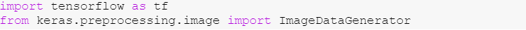

# TekirProjesi
## Kullanıcıdan alınan kedi görselinin hangi cins olduğunu söyleyen yapay zeka projesi

TensorFlow kütüphanesini kullanarak bir Convolutional Neural Network (CNN) modeli eğitirken, aynı zamanda Keras'tan ImageDataGenerator sınıfını içeri aktarır. ImageDataGenerator, modelinizi eğitirken veri artırma (data augmentation) yapmanıza olanak tanıyan bir Keras yardımcı sınıfıdır.
Veri artırma, eğitim veri kümenizi çeşitlendirmek için kullanılan bir tekniktir.

# Verinin Ön işlemesi: Eğitim Setinin Ön işlemesi

Burada resimler üzerinde kırma işlemi uygulanarak 64x64 boyutuna indirgenir. Burada kullanılan parametreler resim işleme ile ilgili parametreleri ifade eder. Batch size'nin büyük olması, daha doğru gradyan değerinin hesaplanmasını sağlamaktadır.
Keras'ın ImageDataGenerator sınıfını kullanarak bir veri artırma işlemi gerçekleştirir ve ardından bu artırılmış veri kümesini bir akış üreteci (generator) olarak kullanır. Bu genellikle evrişimli sinir ağları (CNN) gibi derin öğrenme modellerini eğitirken kullanılır. rescale: Giriş görüntülerinin piksel değerlerini [0, 255] aralığından [0, 1] aralığına ölçekler. shear_range: Görüntüde kesme dönüşümü uygular. zoom_range: Görüntüde yakınlaştırma dönüşümü uygular. horizontal_flip: Görüntüyü yatay eksende çevirme dönüşümü uygular. directory: Veri kümesinin dizini. target_size: Giriş görüntülerinin boyutu. Tüm görüntüler bu boyuta ölçeklenecektir. batch_size: Her eğitim iterasyonunda kullanılacak örnek sayısı. class_mode: Sınıf modu. 'categorical', çok sınıflı sınıflandırma için kullanılır.

# CNN mimarisinin oluşturulması:Nesne oluşturulması

Keras'ta bir modelin oluşturulması için kullanılan bir sınıftır. Bu ifade, sıralı bir model oluşturmayı sağlar, yani katmanları sırasıyla ekleyerek bir modelin mimarisini tanımlamak için kullanılır.

# Convelation

Burada kullanılan Conv2D fonksiyonu sayesinde eldeki datalar 64x64 pixel boyutunda ele alınıcaktır. Buradaki 3 parametresi ise resimler renkli oldugu için 3 adet katman oluşturacaktır.
tf.keras.layers.Conv2D: Bu, bir 2D evrişim katmanını temsil eden Keras sınıfını ekler. Evrişim katmanları, bir görüntü üzerinde belirli özellikleri vurgulamak ve çıkarmak için kullanılır.
filters=32: Bu, evrişim katmanında kullanılacak filtre sayısını belirtir. Filtreler, özellikleri belirlemek ve çıkarmak için kullanılan küçük matrislerdir.
kernel_size=3: Bu, filtrelerin boyutunu belirtir. Burada 3x3 boyutunda bir filtre kullanılıyor.
activation='relu': Bu, evrişim katmanındaki aktivasyon fonksiyonunu belirtir. "ReLU" veya Rectified Linear Unit, yaygın olarak kullanılan bir aktivasyon fonksiyonudur. ReLU fonksiyonu, giriş negatifse 0, pozitifse girişi doğrudan geçirir.
input_shape=[64,64,3]: Bu, evrişim katmanının giriş verisinin şeklini belirtir. Bu örnekte, 64x64 piksel boyutundaki bir görüntüyü ve her piksel için 3 renk kanalını (RGB) kabul eder.

# Pooling

Convolutional Neural Network (CNN) modeline bir MaxPooling2D (Maksimum Havuzlama) katmanı ekler. MaxPooling, bir önceki evrişim katmanının çıkışını küçültmek ve önemli özellikleri vurgulamak için kullanılan bir tekniktir.
tf.keras.layers.MaxPool2D: Bu, bir 2D maksimum havuzlama katmanını temsil eden Keras sınıfını ekler.
pool_size=2: Bu, havuzlama işlemi sırasında kullanılacak havuz boyutunu belirtir. Bu örnekte 2x2 boyutunda bir havuzlama işlemi gerçekleştirilecektir.
strides=2: Bu, havuzlama işlemi sırasında filtrelerin ne kadar kaydırılacağını belirtir. Bu örnekte, havuzlama işlemi her iki eksende de 2 birimlik adımlarla gerçekleştirilecektir.
MaxPooling, her bir bölge içindeki en büyük değeri seçerek önceki katmandaki özellikleri öne çıkarır ve boyutu küçültür. Bu, modelin öğrenme yeteneğini artırabilir ve hesaplama maliyetini azaltabilir.

# Flatting

Convolutional Neural Network (CNN) modeline bir Flatten (Düzleştirme) katmanı ekler. Flatten katmanı, önceki evrişim ve havuzlama katmanlarının çıkışını düzleştirerek, tam bağlantılı katmanlara geçiş yapmak için kullanılır.
Düzleştirme katmanı, 2D matrisleri (görüntü veya özellik haritası) 1D vektöre dönüştürür. Bu, tam bağlantılı katmanlarda kullanılmak üzere veriyi düzenler. Önceki evrişim ve havuzlama katmanlarının çıkışları, bu düzleştirme katmanı aracılığıyla tam bağlantılı katmanlara giriş olarak kullanılabilir

# Full Connection

Convolutional Neural Network (CNN) modeline bir tam bağlantılı (Dense) katman ekler. Tam bağlantılı katmanlar, önceki evrişim, havuzlama ve düzleştirme katmanlarından gelen özellikleri kullanarak sınıflandırma yapmak için kullanılır.
tf.keras.layers.Dense: Bu, bir tam bağlantılı (Dense) katmanını temsil eden Keras sınıfını ekler.
units=128: Bu, katmandaki nöron sayısını belirtir. Her bir nöron, önceki katmanlardan gelen özellikleri kullanarak öğrenir.
activation='relu': Bu, katmandaki aktivasyon fonksiyonunu belirtir. Burada "ReLU" veya Rectified Linear Unit aktivasyon fonksiyonu kullanılır.
Bu tam bağlantılı katman, CNN modelinin öğrenilmiş özellikleri kullanarak giriş verisini sınıflandırmasını sağlar. Bu katman, modelin karmaşıklığını artırarak daha geniş bir öğrenme kapasitesine ulaşmasına yardımcı olabilir.

# Çıkış Katmanı

Convolutional Neural Network (CNN) modeline bir çıkış katmanı ekler. Bu çıkış katmanı, softmax aktivasyon fonksiyonunu kullanarak çoklu sınıflı bir sınıflandırma problemi için tasarlanmıştır.
tf.keras.layers.Dense: Bu, bir tam bağlantılı (Dense) katmanını temsil eden Keras sınıfını ekler.
units=5: Bu, çıkış katmanındaki nöron sayısını belirtir. Bu durumda, 5 sınıf olduğunu varsayalım.
activation='softmax': Bu, çıkış katmanındaki aktivasyon fonksiyonunu belirtir. Softmax aktivasyon fonksiyonu, çıkış nöronlarının sınıflar arasında olasılık dağılımını üretir. Yani, çıkış değerleri sınıfların olasılıklarını temsil eder ve bu olasılıklar toplamı 1'e eşittir.
# Derleme İşlemi

Modelin derlenmesi, modelinizi eğitilebilir hale getirir ve eğitim sırasında kullanılacak optimizasyon stratejisi, kayıp fonksiyonu ve değerlendirme metriklerini belirtir.
optimizer='adam': Bu, eğitim sırasında kullanılacak optimizasyon algoritmasını belirtir. 'Adam' optimizer, adaptif momentum ve RMSprop algoritmalarını birleştiren etkili bir optimizasyon algoritmasıdır.
loss='categorical_crossentropy': Bu, eğitim sırasında kullanılacak kayıp (loss) fonksiyonunu belirtir. 'Categorical Crossentropy', çok sınıflı sınıflandırma problemleri için yaygın olarak kullanılan bir kayıp fonksiyonudur.
metrics=['categorical_accuracy']: Bu, eğitim ve değerlendirme sırasında izlenecek metrikleri belirtir. 'Categorical Accuracy', doğru sınıflandırılan örneklerin oranını ölçen bir metriktir

# Eğitim Seti

Convolutional Neural Network (CNN) modelini eğitir. fit fonksiyonu, modelinizi belirli veri kümesi üzerinde eğitirken kullanılır.
x=training_set: Bu, eğitim veri kümesini belirtir. training_set genellikle bir veri akış üreteci (data generator) olup, eğitim verilerini sağlar.
validation_data=test_set: Bu, modelin eğitim sırasında doğrulama (validation) verilerini kullanmasını sağlar. test_set genellikle bir veri akış üreteci olarak belirtilir ve eğitim süreci sırasında modelin performansını değerlendirmek için kullanılır.
epochs=50: Bu, eğitim sırasında modelin kaç epoch boyunca eğitileceğini belirtir. Bir epoch, tüm eğitim verilerinin tamamen geçildiği bir iterasyonu temsil eder.

Convolutional Neural Network (CNN) modelini kullanarak bir test görüntüsü üzerinde tahmin yapmaya yöneliktir. İlgili kodun adım adım açıklamaları şu şekildedir: image.load_img('/content/drive/MyDrive/testtcatss/fivecats2.jpeg', target_size=(64, 64)): Test için kullanılacak görüntüyü yükler. Görüntü, belirtilen target_size (hedef boyut) parametresine göre yeniden boyutlandırılır.
image.img_to_array(test_image): Yüklenen görüntüyü bir NumPy dizisine dönüştürür.
np.expand_dims(test_image, axis=0): Görüntüyü bir diziye çevirirken boyutunu genişletir. Model genellikle bir grup örnek (batch) ile çalıştığından, bu adım tek bir örnek içeren bir grup oluşturur.
result = cnn.predict(test_image): Modeli kullanarak görüntü üzerinde tahmin yapar. result değişkeni, her bir sınıf için tahmini olasılıkları içeren bir NumPy dizisini temsil eder.
class_indices = training_set.class_indices: Eğitim setindeki sınıf indekslerini içeren bir sözlük oluşturur.
class_labels = {v: k for k, v in class_indices.items()}: Sınıf indeksleri ile sınıf etiketleri arasında bir eşleme oluşturur.
predicted_class_index = np.argmax(result): Tahmin sonuçlarından en yüksek olasılığa sahip olan sınıfın indeksini alır.
predicted_class_label = class_labels[predicted_class_index]: En yüksek olasılığa sahip olan sınıfın etiketini bulur.
Bu kod bloğu, belirtilen test görüntüsü üzerindeki model tahminini gerçekleştirir. predicted_class_label değişkeni, modelin tahmin ettiği sınıfın etiketini içerir. Bu tahmin, eğitim sırasında kullanılan sınıf etiketleri ile eşleştirilebilir.

#License
[MIT License](./LICENSE)
